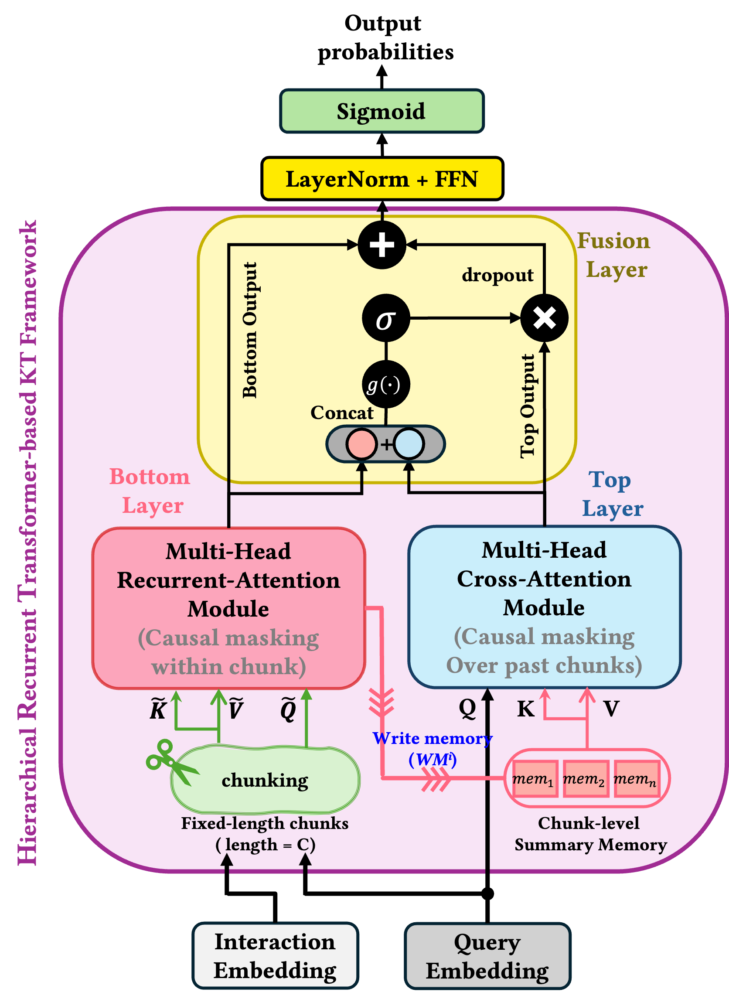
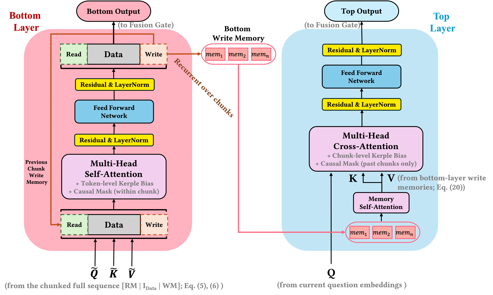

# HRKT
This repository provides a PyTorch reference implementation of **HRKT-SAKT**, 
the SAKT-based version of Hierarchical Recurrent Knowledge Tracing (HRKT).

HRKT is designed for efficient long-sequence knowledge tracing by separating 
local interaction modeling and global knowledge evolution through a hierarchical 
recurrent Transformer architecture.

## Architecture

HRKT consists of three main components:

1. **Bottom Layer**  
   Processes long interaction sequences chunk by chunk using recurrent memory tokens.
   It captures local question-response interaction patterns within each chunk.

2. **Top Layer**  
   Collects chunk-level write memories and models long-term knowledge evolution
   through memory self-attention and cross-attention.

3. **Fusion Layer**  
   Adaptively combines local representations from the Bottom Layer and global
   representations from the Top Layer using a gated fusion mechanism.

<p align="center">
  
</p>

<p align="center">
  
</p>

## File Structure

```text
HRKT/
├── README.md
├── figures/
│   ├── architecture_overview.png
│   └── hrkt_internal_architecture.png
└── model.py
```

## Usage

The following example shows how to instantiate `HRKT_SAKT` and run a forward pass
with dummy knowledge tracing data.

```python
import torch
from model import HRKT_SAKT

batch_size = 64
seq_len = 1000
num_q = 1200

q = torch.randint(1, num_q + 1, (batch_size, seq_len)).long()
r = torch.randint(0, 2, (batch_size, seq_len)).long()
qry = torch.randint(1, num_q + 1, (batch_size, seq_len)).long()

model = HRKT_SAKT(
    num_q=num_q,
    max_len=seq_len,
    d_model=64,
    num_heads=4,
    dropout=0.2,
    chunk_len=50,
    mem_len=4,
    top_dropout=0.3,
    top_d_ff_ratio=4,
)

out = model(q=q, r=r, qry=qry)

print(out.shape)
```

Expected output:

```text
torch.Size([64, 1000])
```

## Requirements

This implementation requires:

```text
torch
numpy
```


